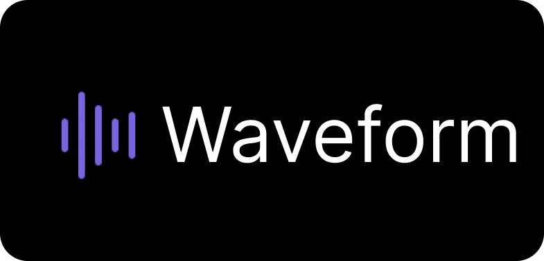

 


## Project Overview

Waveform is a Spotify clone built with Next.js, NextAuth.js, Tailwind CSS, and the Spotify API. This project aims to recreate the popular music streaming experience provided by Spotify while utilizing modern web development technologies.

## Features

- **User Authentication:** Waveform incorporates user authentication using NextAuth.js, allowing users to create accounts, log in securely, and enjoy a personalized music experience.

- **Spotify API Integration:** The project seamlessly integrates with the Spotify API to fetch user data, playlists, and music tracks. Users can browse and play their favorite songs just like they would on Spotify.

- **Responsive Design with Tailwind CSS:** The application is designed to be responsive across various devices, thanks to the use of Tailwind CSS. The user interface is visually appealing and user-friendly.

- **Dynamic Routing with Next.js:** Next.js is utilized for dynamic routing, making the application's navigation smooth and enhancing the overall user experience.

## Getting Started

To run the project locally, follow these steps:

1. Clone the repository: `git clone https://github.com/your-username/waveform.git`
2. Navigate to the project directory: `cd waveform`
3. Install dependencies: `npm install`
4. Configure environment variables:
    - Create a `.env.local` file in the root directory.
    - Add the following variables and replace the placeholders with your Spotify API credentials:
      ```
      SPOTIFY_CLIENT_ID=your_spotify_client_id
      SPOTIFY_CLIENT_SECRET=your_spotify_client_secret
      NEXTAUTH_URL=http://localhost:3000
      ```
5. Run the development server: `npm run dev`
6. Open your browser and go to [http://localhost:3000](http://localhost:3000) to access Waveform.

## Dependencies

- [Next.js](https://nextjs.org/): A React framework for building server-rendered and statically generated web applications.
- [NextAuth.js](https://next-auth.js.org/): An authentication library for Next.js applications.
- [Tailwind CSS](https://tailwindcss.com/): A utility-first CSS framework for building modern designs.
- [Spotify API](https://developer.spotify.com/documentation/web-api/): The official Spotify API for fetching music data.
